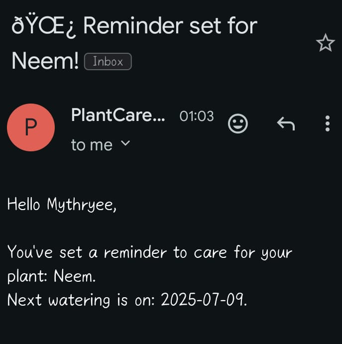

# 🌐 Portfolio Website Deployment (Docker + Kubernetes)

Welcome to my **Personal Portfolio Website Deployment Project**!  
This project showcases **full-stack web development + DevOps skills** by building, containerizing, and deploying my portfolio using **Docker** and **Kubernetes**.

## 🚀 Features

✅ **Responsive Design** – Mobile-friendly and works on all devices  
✅ **Contact Form with Validation** – PHP backend with MySQL storage + email confirmation via PHPMailer (SMTP)  
✅ **Multi-Container Docker Setup** – Separate App and MySQL containers via Docker Compose  
✅ **Optimized Dockerfiles** – Smaller image size & faster builds  
✅ **Kubernetes Deployment** – Deployments, Services, Persistent Volumes, Rolling Updates  
✅ **Probes for Monitoring** – Readiness & Liveness probes for pod health checks  
✅ **Zero Downtime Updates** – Rolling updates with Kubernetes  
✅ **Environment Variables** – For DB credentials & SMTP configuration  


## 🛠️ Tech Stack

| Category         | Tools / Technologies |
|------------------|----------------------|
| Frontend         | HTML5, CSS3, JavaScript |
| Backend          | PHP, MySQL |
| Email System     | PHPMailer (SMTP with Gmail) |
| Containerization | Docker, Docker Compose |
| Orchestration    | Kubernetes (kubectl, Minikube) |
| Deployment       | Deployments, Services, PVCs, Probes |
| Other            | Prompt Engineering |

---
## 🖥️ Screenshots
# Docker

| Home |
|------|
|  |
# Docker

| Home |
|------|
|  |


---
## 📸 Mail
|  |

## 📂 Folder Structure
```
deploy/
├── components/
│   └── navbar.php
├── includes/
│   ├── db.php
│   ├── mailer.php
│   └── process_form.php
├── phpmailer/
├── public/
│   ├── index.php
│   └── style.css
├── sql/
│   └── init.sql
├── k8s/
│   ├── mysql-deployment.yaml
│   ├── mysql-pv-pvc.yaml
│   └── mysql-secret.yaml
│   └── php-deployment.yaml
├── .env
├── Dockerfile
└── docker-compose.yaml

```
## 2️⃣ Docker images

You already have a Dockerfile for PHP + Apache and docker-compose.yaml for local testing. For Kubernetes, you need to build images and push them to Docker Hub:
```
Build PHP image
docker build -t mythryee/portfolio:v1 .

Push PHP image
docker push mythryee/portfolio:v1

 MySQL image we can use official: mysql:8.0
```

## 4️⃣ Apply Kubernetes configuration
```
kubectl apply -f k8s/mysql-deployment.yaml
kubectl apply -f k8s/mysql-pv-pvc.yaml
kubectl apply -f k8s/mysql-secret.yaml
kubectl apply -f k8s/php-deployment.yaml
```
## or if you want to run everything at once
```
kubectl apply -f k8s/
```

## 5️⃣ Test the deployment

Get PHP service external IP (for Minikube):
```
minikube service php-service
Test your app in browser: it should be live and connected to MySQL.
```

✅ Everything works 100% with your existing folder structure.
✅ No code changes needed. Only need to build PHP Docker image and push to Docker Hub.
